# 打开量化投资的黑箱（上）

分享人：李一繁

时间：2022年1月26日

适用人群：不熟悉金融投资知识的数据科学从业者


# 章节结构

本文档分享的内容聚焦在《打开量化投资的黑箱》的第一和第二部分，这部分的内容结构非常清晰首先是介绍了我们首先要用阿尔法模型赚取收益、用风险模型减小过程中的损失、用交易成本模型来控制成本，之后用这三个模型进行投资组合的构建，最终下单执行。整个过程依赖于金融数据，并需要持续不断的研究优化。

**我从这两部分中抽取出了认为可以值得一讲的话题列在了下面，前面的G是PDF电子版文件的页数，等于真实页数+23**。但是由于这本书的讲述方式是按照构建量化模型的步骤来的，对金融出身但不懂量化的同学可能可以顺畅读完，但是这条路径对缺乏金融投资知识背景的同学就不甚友好了。所以我根据这两部分的内容重新整合成新的金融知识结构，帮助大家厘清其中的金融背景知识，大家可以直接跳到[知识结构](#知识结构)进行阅读，读完之后可以再回到章节结构下我列出的话题，可能就能够理解书中在说什么了。

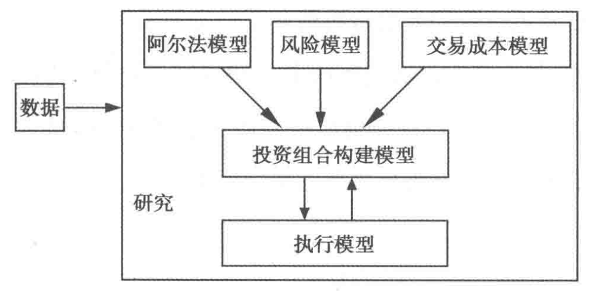

## 前言

**G7 马科维茨 1952 投资组合理论假设**

## 第1章 关注量化交易的原因

G28 交易市场：股票、期货、外汇、商品交易、HF
**G29 正向影响：促进市场流动性，有效市场和无效市场**
**G30 套利策略：pari trading**
**G31 策略思考：廉价、P/E**
G33 风险度量：过度依赖量化度量LTCM，理解度量风险的收获
**G34 遵守纪律：处置效应、行为金融学**、量化投资

## 第2章 何为宽客

G37 何为宽客：系统运转日常管理、人的介入、美银美林，M&A
G38 界定宽客：不同的交易策略、伪宽客技术
G40 系统框架：变种和递归

## 第3章 阿尔法模型：宽客如何盈利

**G45 阿尔法：阿尔法和贝塔，非常规定义，其他称谓**
G47 两类策略：理论和经验Q/P派、经验少数派
G49 理论驱动：6类策略
G50 趋势跟随策略：市场均衡、博傻理论、滤波调理、CTA，文艺复兴基金，互联网泡沫和郁金香
G54 均值回复策略：均值回复，美林和嘉信，长趋势短回复，均值回复和动量
G58 技术情绪型策略：价量波动性，期权的认购认沽和隐含波动性，限价指令簿
**G59 基本面价值型策略：Fama-French，P/E和E/P，高估高风险和低估低风险？、利差交易、收益的风险理由、QLS**
**G64 基本面成长型策略：PEG，宏/微观成长策略，分析师预期收益，情绪型和成长型**
G66 基本面品质型策略：5类关注点
G68 数据驱动型alpha：门槛和先于理论，高频优势，3个缺陷，靠不住难解释，环境、相似、回溯
G72 实施策略：预测目标(信号强度)、投资期限(收益差别)、投注结构(配对法、大类投注、分组)、投资范围(比如不投医药)、模型设定(定义、参数、重拟合)、条件变量(修正、辅助)、运行频率(机会和成本、)
G84 混合型阿尔法：4种构建方法，线性和双因素混合，非线性(条件模型、旋转模型)，机器学习，信号混合和投资组合构建
G85 贝叶斯和频率学派

## 第4章 风险模型

G94 风险敞口：规模限制或剔除，降低策略盈利但是减少波动性
**G97 控制规模：硬性约束和惩罚函数，度量风险(标准差和离散度)，限制值的适用范围，杠杆率和VaR值，波动率固定的缺陷，杠杆的使用**
G100 限制风险种类：清除无意义敞口，理论驱动(系统和非系统风险(马云))，经验驱动(PCA)，如何选择(热启动和自适应)，经验模型缺点(数据要求、环境变化)

## 第5章 交易成本模型

**G108 交易成本：交易原因，告知而不是减小成本，三部分成本**
G110 佣金费用：佣金清算结算，EMN，暗池交易
G111 滑点费用：滑点是什么，均值回复和滑点，波动性和滑点
G112 市场冲击：观察类似交易的冲击，滑点和市场冲击(反身性)，ECN和暗池
G115 交易成本：4类交易成本，单一产品成本历史计量

## 第6章 投资组合构建模型

G121 构建模型：规则模型和优化模型
G122 基于规则-头寸：相等头寸加权(足够好、方向性、减少数据问题，但有流行性问题)，非等权重缺点(统计学意义、头寸集中、逆向选择)
**G125 基于规则-风险：风险加权(CVaR)，缺点基于历史**
G126 基于规则-阿尔法驱动：强调盈利的加权
**G127 投资组合最优化：MVO，MPT，有效前沿，边界约束**
**G130 如何计算：期望收益(方向性预测)，期望波动率(GARCH)，相关系数矩阵(可能不稳定)，优化技术(无约束、带约束、BL、GK、重新取样、MCS、数据挖掘)**
G143 宽客选择：相对阿尔法(稳定性)、绝对阿尔法(关注风险限制和收益预测)

## 第7章 执行模型

**G148 ECN、DMA都是交易所，电子交易比人更可靠，自己执行和外包**
**G149 订单执行算法：中间市场价格、VWAP**
G151 进取订单(规模虚大)、被动订单(限价)，信号强弱，中间报价，跟单推单，订单频谱
G156 其他订单：暗订单(冰山算法)，收盘市价订单和停止限价订单等等，NMS规则
G160 何处下单：流动性分池的智能下单方法，明/暗交易平台，暗池流动性
G161 交易基础设施：DMA和主机托管，FIX协议

## 第8章 数据

G166 重要性(GIGO)，数据类型(价格/基本面数据)，数据来源(WIND/CHOICE,Tushare)，数据清洗(前视偏差)，数据存储(平面、指针平面，数据库，立方体)

## 第9章 研究

G182 科学方法：观察->解释->推断->检验，宽客持续修正
G183 思想的产生：市场观察、学术文献、研究员和FM、主观教训
G186 检验方法：累计盈利图、平均收益率、收益率变异性(块度)、波峰波谷最大降幅、预测力(R2、分位数)、胜率或盈利时间占比、夏普比率和其他、策略组合关系、时间延迟(T+1)、特定参数的敏感性
G198 检验注意：过度拟合，样本外检验(OOB、滚动处理、前视偏差和加工数据)，假设条件(交易成本、空头头寸)

## 第10章 量化策略的风险内生性

G212 模型风险：①建模不适宜：错误建模（音乐家）、错误应用（VaR历史、相关性）；②模型误设：无法对世界很好描述，如07年8月大盘流动性风险（集体下跌）；③执行错误：编程问题（12年骑士资本、09年安盛）

G217 结构关系风险：嘉信理财和美林证券、价值股和成长股

G221 外生冲击风险：911、贝尔斯登

G223 蔓延风险和同质投资者风险：大跌亏损导致相同策略清盘，07年量化清算危机：①多头空头策略普及程度（策略相似）；②头寸损失；③交叉抵押；④目标风险定位VaR（波动率、相关性上升）。总结：因为亏损开始去杠杆的同时风险加大要求去的更多（软着陆、硬着陆），**需要好好研究普尔特房地产的案例**

G231 宽客如何监控风险：①敞口监控工具；②损益监控；③执行监控工具；④系统性能监控工具。

**工具很简单，如何使用是个艺术，每天盯着也是用**

## 第11章 对量化交易的批评

G236 艺术非科学：人的行为可以量化

G237 低估风险：任何领域的决策者都会犯模型假设错误，能降低市场波动性和无效性

G239 08年市场：问题都来自最下层，结构化产品的问题

G243 不能快速变化：除非市场重大变化很快，也能从市场的负面影响中获利

G245 完全相同：一个宽客的多头头寸不可能是另一个的空头头寸，

G247 大的存活：大的不一定好：①调整组合麻烦；②策略非最优；③自满；④扩张导致专业化低；⑤判断力。

G250 数据错误：数据挖掘无罪，过度拟合问题（建议：短周期）

## 第13章 高速及高频交易概要

G277 高频交易占50%，定义是有高速交易设施、小于1天、没隔夜头寸，4个分类

G280 盈利能力低每股0.001美元，市场利润大概13亿美金，其实利润越来越稀薄

## 第14章 高速交易

G284 速度的重要性：被动订单、进取型订单（市价订单）、取消被动型，流动性定义

G287 被动订单的速度：Tradeworx、队列前后亏2分钱，逆向选择、交易量、维护成本

G293 延迟根源：①市场内外传输：匹配引擎、交叉连接、主机托管；②市场中心间的传输：整合数据、光纤和微波；③建立订单簿：整合订单簿、数据突发**（信息率不平稳**、信号构建、风险检查（客户自检还是经纪商）

## 第15章 高频交易

G307 契约型做市（CMM）：订单内在化者（做市商和经纪公司），小订单自动填充，大订单可能存在不正当动机

G312 非契约型做市（NCMM）：被动订单、流动性回扣，积极退出头寸的风险

G314 套利：市场无效性、指数套利、跨市场套利

G316 快速阿尔法策略：和套利区别、也要低延迟

G318 高频交易风险管理和投资组合构建：做市商是要清理库存而不是担心风险敞口，设置易于计算的风险防止减慢下单速度，滞后风险，套利的投资组合，**交易成本是获利的资源**，

# 知识结构

本书前两部分的知识结构可以分为3部分：金融的基础理论，和证券投资的过程、策略，以及金融行业的实务操作和重大事件。里面的知识点章节大体能对应上原书章节的情况如下：

- 基础理论中传统金融学部分的马科维茨MVO会解释**第6章的投资组合构建模型**
- 基础理论中传统金融学部分的尤金法玛五因子模型可以帮助理解**第3章的阿尔法策略**
- 基础理论中风险理论部分可以帮助理解**第4章的风险模型**
- 证券投资中交易过程可以帮助理解**第5章的交易成本模型**和**第7章的执行模型**

## 基础理论

### 金融学发展

金融学的历史可以追溯到很远，为了实用这里我直接跳到可以开始**定量计算**的金融学时期，介绍其发展脉络。

近代的金融学主要可以分为传统金融学和行为金融学两个门类，量化投资中涉及到金融计量的都是来自于传统金融学，但是由于人的情绪因素，市场发生了很多传统金融学假设下无法解释的问题，所以诞生了行为金融学，但这并不是我们的重点。

#### 传统金融学

传统金融学主要介绍1个概念和3个人物。

##### 理性人假说

理性人假说是经管类学科的基石理论，这个假说人有三个完全：

- ①perfect rationality（完全理性），比如如果要买基金，我得把市场上的基金都研究一遍，然后找到最好的那只
- ②perfect self-interested（充分自利），追求效用最大化，下面会展开介绍
- ③perfect information（获取所有信息），我们可以获取市场上的所有信息来进行决策

这三个假说大家听完可能就会感觉有点过于严格了，不过如果我们也投资的话，代入一下也能感到其实我们也在追求这三点。

完全理性和获取所有信息直观上就可以理解了，但是什么是效用最大化呢？下面这三张图的横轴都是财富水平，而纵轴是财富带来的效用，你可以理解成这个效用就是财富给我们的满足感，那么这三张图的斜率就可以看成：**每获得1单位的财富，我们的满足感的变化**。我们还要把后面金融学的一个好理解的概念前置，就是**在追求更多财富的时候会带来更多的风险**。

先看第二张图，发现随着财富增多我们的满足感的增量在不断减少，这是符合大多数人的规律的，因为如果你已经是千万富翁了，再给你1百万的效用肯定不如在你贫穷时候来的满足感大，这种斜率不断在下降的规律也就是经济学著名的**边际效用递减**。当这个人足够有钱时，他可能就不愿意冒太多风险去追求财富了，所以我们叫这类人是**Risk-Averse（风险厌恶）**的。

但是图三我们可以看到这个人财富增多时带来的满足感在不断增加，后期他可能会为了1元钱的收益都铤而走险，我们称其为**Risk-Seeking（风险追求）**的。

那第一张图我们就可以看到这个人非常理性，增加财富带来的效用都是固定的，他不会盲目追求金钱，也不会因为钱太多而讨厌任何有风险的赚钱机会，所以这种人我们把他叫做Risk-Neutral（风险中性）。

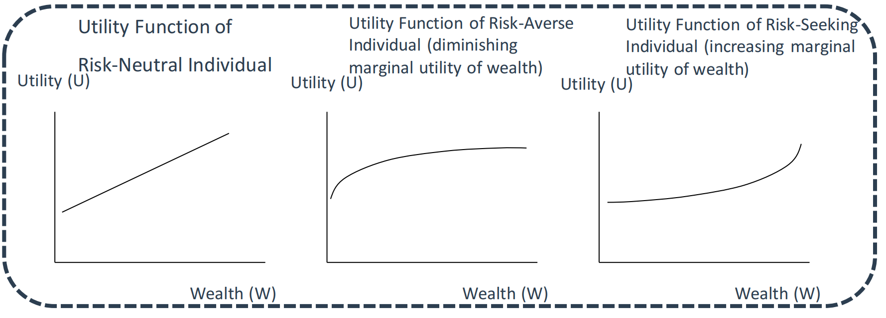

经济学本来是不好量化的学科，但是因为效用理论的出现，我们好像可以用数学来做点什么了：

- ①completeness：选择和偏好已知，从而能做出排序，即A>B>C
- ②transitivity：排序是有一致性，满足传导律，即A>B,B>C=>A>C
- ③independence：效用是additive（可加），即A>B=>A+C>B+C；并且divisible（可分割），即A>B=>A+0.5C>B+0.5C
- ④continuity：Indifference curves（无差异曲线）是smooth和unbroken的，即Y=W1X+W2Z，详见扩展阅读。

上面提到的效用曲线只有1个变量——财富增益，这是为了让大家方便理解和接受。但是我也事先说明了收益和风险并存，所以实际上我们的财富效用是这样的表述：**效用 = 收益 - 风险**，进一步的，我们直接给出联通金融概念和金融量化的符号：**收益率 = 资产在一定时期的增长率**，**风险 = 资产在一定时期收益率的标准差**。
$$
U = E(r_p) - \frac{1}{2}\lambda \sigma _p^2
$$
由于我们这里只考虑亏损的风险，所以乘上1/2，其中λ表示风险厌恶系数。效用函数在后面的计算中并不重要，这里只是用它来帮我们理解金融风险和收益的关系。

有的教科书上的效用理论上会用无差异曲线来解释，无差异曲线是两个物品的权重加和算出总效用，即Y=W1X+W2Z，一个给定的Y我们可以画出1条无差异曲线，这条曲线上的每个点对应着X和Z的不同配比，但是配比计算出的总效用都是一样没有差异的，所以也叫无差异曲线。不同的Y能画出不同的无差异曲线，所以有无数条。然后这种场景还会有一个预算限制，从而画出一条预算线，如何取出效用最大的配比呢？在图上我们可以找到和这条预算线仅有1个切点的无差异曲线，这个时候的Y肯定就是最大的了，当然实际求解的时候我们还是列个2阶矩阵来计算。

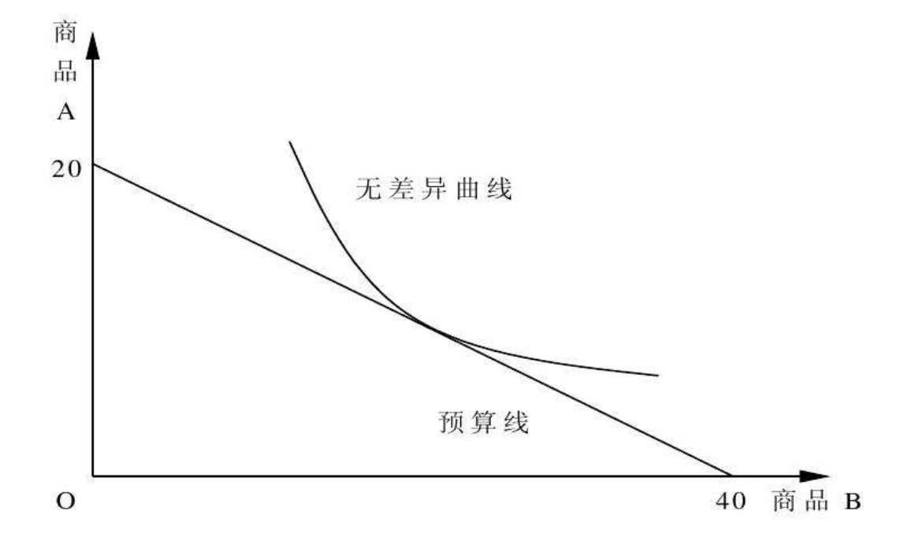


##### 马科维茨（ Markowitz）

效用理论用增长率代表收益，用标注差代表风险，给金融的计量创造了机会。但是我们也知道鸡蛋不能押在同一个篮子里，常规的投资方式肯定不会把资金All in在一个股票里，而是用资产组合的方式。1952年，马科维茨提出了投资组合理论假设，他开创性的使用组合的均值和方差最优化的思想构建了最优的投资组合管理方式，他的这个方法叫做：mean-variance optimization，下面简称MVO，MVO将金融的可量化性推上了一个新高度。

构建MVO的步骤本质就是先构建有限前沿，再画CML（资本市场线），最后用效用曲线和其相切。

###### 如何构建有效前沿？

- Step1：基于历史去计算各资产的收益、标准差、协方差
- Step2：计算整体组合的收益和标准差
- Step3：随机按任意权重配比各资产，以组合的收益为纵轴、风险为横轴画出所有可能的组合
- Step4：然后获取点堆积形状的左外侧轮廓曲线，这就是global minimum variance portfolio（全球最小方差组合）
- Step5：取曲线的上半部分，因为相同风险的情况下要收益更大的，这就是efficient frontier（有效前沿）

$$
E(R_p) = E(\sum_{i=1}^Nw_iR_i)=\sum_{i=1}^Nw_iE(R_i)
=[w_i, w_2,...,w_N][E(R_1),E(R_2),...,E(R_N)]^T
$$

$$
\sigma_P^2 = w_1^2\sigma_1^2+w_2^2\sigma_2^2+2w_1^2w_2^2Cov(R_1,R_2)
=w_1^2\sigma_1^2+w_2^2\sigma_2^2+2w_1^2w_2^2\rho_{12}\sigma_1^2\sigma_2^2
$$

$$
波动率大致遵循平方根法则：   
周波动率 = \sqrt{5} \times 日波动率  
月波动率 = \sqrt{22} \times 日波动率  
年波动率 = \sqrt{252} \times 日波动率
$$


```python
import numpy as np
import pandas as pd
import matplotlib.pyplot as plt
from pylab import mpl
mpl.rcParams['font.sans-serif'] = ['SimHei']
mpl.rcParams['axes.unicode_minus'] = False

data = pd.read_excel('./构建投资组合的五只股票数据（2016-2018）.xlsx',\
                          sheet_name='Sheet1', header=0, index_col=0)
                          
x = np.random.random(5) # 构建随机数
weights = x/np.sum(x) # 权重加和为1
R = np.log(data/data.shift(1)) # 计算连续收益率
R_mean = R.mean()*252 # 计算均值
R_cov = R.cov()*252 # 计算协方差
R_corr = R.corr() # 计算相关系数
R_vol = R.std() * np.sqrt(252) # 计算标准差
R_port = np.sum(weights*R_mean) # 计算组合收益率
vol_port = np.sqrt(np.dot(weights, np.dot(weights,R_cov,weights.T))) # 计算组合的标准差
```

```python
## 绘制可行集合
Rp_list = [] #初始投资组合收益率数列
Vp_list = [] #初始投资组合收益率波动率数列
for i in np.arange(1000):
    x=np.random.random(5)
    weights=x/sum(x)
    Rp_list.append(np.sum(weights*R_mean))
    Vp_list.append(np.sqrt(np.dot(weights,np.dot(R_cov, weights.T))))
## 画图
plt.figure(figsize=(8,6))
plt.scatter(Vp_list, Rp_list)
plt.xlabel(u'波动率', fontsize=13)
plt.ylabel(u'收益率', fontsize=13, rotation=0)
plt.xticks(fontsize=13)
plt.yticks(fontsize=13)
plt.xlim(0.1, 0.28)
plt.ylim(-0.1, 0.2)
plt.title(u'投资组合收益率与波动率关系', fontsize=13)
plt.grid('True')
plt.show()
```

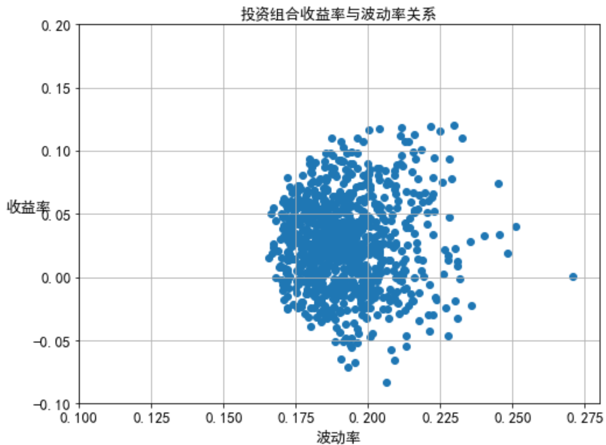


$$
\mathop{min}_{w_i}\sigma_P = \mathop{min}_{w_i}\sqrt{\sum_{i=1}^N\sum_{j=1}^Nw_iw_jCov(R_i, R_j)}
$$

$$
约束条件是\sum_{i=1}^Nw_i=1, w_i>0，即股票不允许卖空
$$

```python
import scipy.optimize as sco
def f(w): # 定义一个求解最优化的函数
    w=np.array(w)
    Rp_opt=np.sum(w*R_mean)
    Vp_opt=np.sqrt(np.dot(w,np.dot(R_cov, w.T)))
    return np.array([Rp_opt, Vp_opt])
def Vmin_f(w):  # 定义一个得到最小波动率的权重函数
    return f(w)[1]
cons = ({'type':'eq', 'fun':lambda x: np.sum(x)-1}, {'type':'eq', 'fun':lambda x:f(x)[0]-0.1})
bnds = tuple((0,1) for x in range(len(R_mean))) # 以元组形式输入权重的边界条件
result = sco.minimize(Vmin_f, len(R_mean)*[1.0/len(R_mean),], method='SLSQP', bounds=bnds, constraints=cons)

## 进行有限前沿可视化之前需要全局计算投资收益率和波动率
cons_vmin = ({'type':'eq', 'fun':lambda x: np.sum(x)-1})
result_vmin = result = sco.minimize(Vmin_f, len(R_mean)*[1.0/len(R_mean),], method='SLSQP', bounds=bnds, constraints=cons_vmin)
Rp_vmin = np.sum(R_mean * result_vmin['x'])
Vp_vmin = result_vmin['fun']
    
## 进行有效前沿的可视化
Rp_target = np.linspace(Rp_vmin, 0.25, 100) #生成投资组合的目标收益率数组
Vp_target = []
for r in Rp_target:
    cons_new = ({'type':'eq', 'fun':lambda x: np.sum(x)-1},{'type':'eq', 'fun':lambda x :f(x)[0]-r})
    result_new = sco.minimize(Vmin_f, len(R_mean)*[1.0/len(R_mean),], method='SLSQP', bounds = bnds, constraints=cons_new)
    Vp_target.append(result_new['fun'])
plt.figure(figsize=(8,6))
plt.scatter(Vp_list, Rp_list)
plt.plot(Vp_target, Rp_target, 'r-', label=u'有效前沿', lw=2.5)
plt.plot(Vp_vmin, Rp_vmin, 'y*',label=u'全局最小波动率', markersize=14)
plt.xlabel(u'波动率', fontsize=13)
plt.ylabel(u'收益率', fontsize=13, rotation=0)
plt.xticks(fontsize=13)
plt.yticks(fontsize=13)
plt.xlim(0.15, 0.28)
plt.ylim(-0.1, 0.25)
plt.title(u'投资组合有效前沿', fontsize=13)
plt.legend(fontsize=13)
plt.grid('True')
plt.show()
```

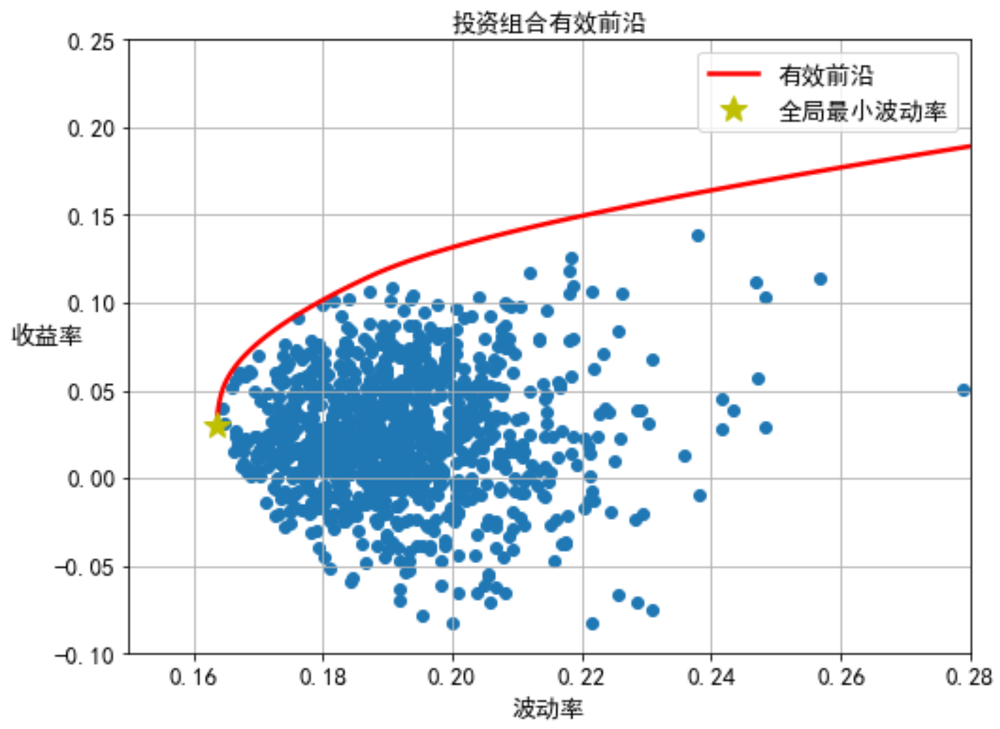

###### 如何构建资本市场线？

在马科维茨的理论中，甚至当下的资产配置方式都是将股票债券作为主要投资品种，因为这两个市场的体量最大，参与者最多。

股票我们有时候也叫权益投资（Equity Investment），它风险更高，所带来的收益也很高，另一种债券我们有时候也叫固定收益投资（Fixed Income Investment），投资债券相当于把你的钱借给别人，别人以约定的利息还给你，由于债券市场的融资主体信用评级更高，所以出现违约的情况会比较少，像国债这种以国家信用作为担保的，都可以看成不会违约（LTCM和俄罗斯国债事件除外）。

我们利用最优化地方方法构建了股票投资组合的有效前沿，理论上我们可以投资在这条线上的任何点，并不能肯定的说收益率更高的点A的股票组合就比点B好，毕竟点A承担了更多的风险。但是当引入债券后，我们就可以在有效前沿上找到这么一个点，**使得单位风险  投资股票的增益  最大**。

假设1年期国债的收益率是2%，其风险为0，我们从坐标轴上(0, 2%)的这个点出发，做一条直线正好相切到有效前沿的边界上，这条线就是资本市场线（Capital Market Line，简称CML），在这条线上做的投资组合，都是满足了上面说的**单位风险投资股票的增益最大**的条件。
$$
计算资本市场线的斜率就是求解最大值：  
\mathop{max}_{w_i}\frac{E(R_p)-R_F}{\sigma_P}
$$

```python
import scipy.optimize as sco
def F(w):
    Rf=0.02 # 假设无风险利率（可以看成国债收益率）是2%
    w=np.array(w)
    Rp_opt=np.sum(w*R_mean)
    Vp_opt=np.sqrt(np.dot(w,np.dot(R_cov, w.T)))
    SR=(Rp_opt-Rf)/Vp_opt
    return np.array([Rp_opt, Vp_opt, SR])
def SRmin_F(w):
    return -F(w)[2]
cons_SR = ({'type':'eq', 'fun':lambda x: np.sum(x)-1})
result_SR = result_new = sco.minimize(SRmin_F, len(R_mean)*[1.0/len(R_mean),], method='SLSQP', bounds = bnds, constraints=cons_SR)

Rf = 0.02
slope = -result_SR['fun'] #CML的斜率
Rm = np.sum(R_mean*result_SR['x'])
Vm = (Rm -Rf)/slope

Rp_cml = np.linspace(0.02, 0.25)
Vp_cml = (Rp_cml - Rf)/slope

plt.figure(figsize=(8,6))
plt.scatter(Vp_list, Rp_list)
plt.plot(Vp_target, Rp_target, 'r-', label=u'有效前沿', lw=2.5)
plt.plot(Vp_cml, Rp_cml, 'b--', label=u'资本市场线', lw=2.5)
plt.plot(Vm, Rm, 'g*',label=u'市场组合', markersize=14)
plt.plot(Vp_vmin, Rp_vmin, 'y*',label=u'全局最小波动率', markersize=14)
plt.xlabel(u'波动率', fontsize=13)
plt.ylabel(u'收益率', fontsize=13, rotation=0)
plt.xticks(fontsize=13)
plt.yticks(fontsize=13)
plt.xlim(0.0, 0.3)
plt.ylim(-0.1, 0.25)
plt.title(u'投资组合理论的可视化', fontsize=13)
plt.legend(fontsize=13)
plt.grid('True')
plt.show()
```

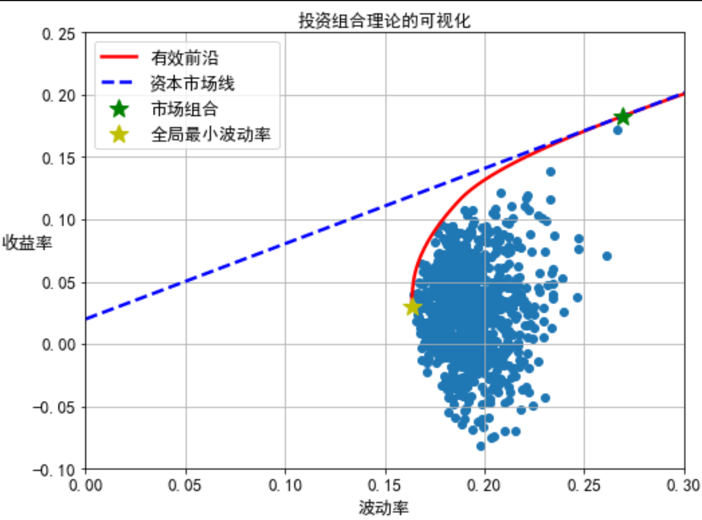


###### MVO的修正

既然使用了模型，就一定有可以改进的地方，下面有人针对MVO提出了很多问题，这些问题分别对应着一种改进方法：

- 输入敏感：增加限制

- 高度集中在低风险高收益的资产： Resampled 重采样

- 不用历史收益率：Reverse Optimization 反优化

- 增加分析师观点：BL Model

- 非正态分布：将最小化标准差风险换成其他，比如mean-semivariance

- 可能风险没有分散：factor-based 因子模型法

- 只计算了一期：Monte Carlo Simulation 蒙特卡洛模拟

  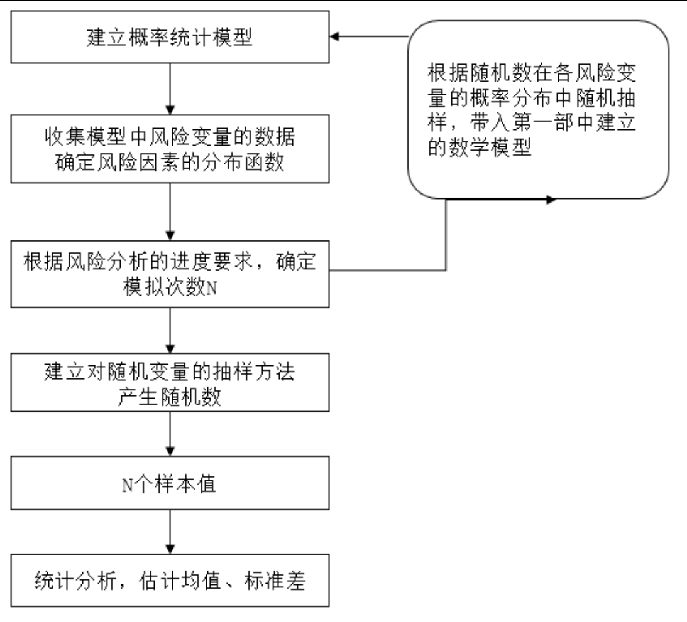

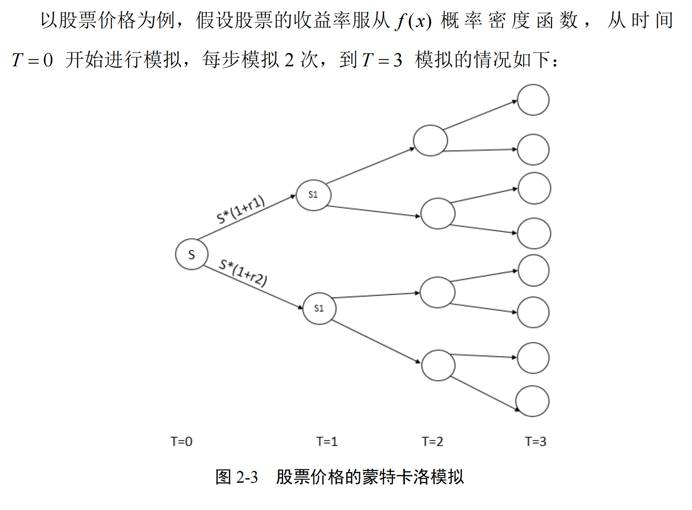

**扩展阅读：**

[1] [马科维茨，整个现代金融的开始](https://xueqiu.com/4678288336/76714417)

[2] [MVO的修正](https://nbviewer.org/github/fcncassandra/code-for-CFA/blob/main/AA.ipynb#13.1.1-MVO)

##### 威廉夏普（William Sharp）

###### CAPM是什么？

威廉夏普是马科维茨的学生，他在马科维茨的基础上进一步研究。MVO告诉了我们如何去进行股票投资，但是没有去展开投资分析。威廉夏普进一步的提出了资本资产定价模型，他将股票i的期望收益率拆解成了3个部分进行研究，分别是无风险收益率、大盘的超额收益以及股票收益率对大盘的收益率的敏感程度（也成β）。
$$
E(R_i) = R_F + \beta_i[E(R_M) - R_F]
$$
前两部分很好理解，第三部分也是**量化中经常说的的部分β**可以看成这个股票对大盘的一个联动风险，如果β大于1，就意味着你承担了更多的风险，应当获得更多的回报。这里也给出详细计算的方法，如果有股票A，对其β求解可以将股票A用线性回归的方式和大盘拟合计算出斜率项，也可以直接用公式
$$
\beta = \frac{cov(A, M)}{Var(M)}=\frac{\rho_{A,M}\sigma_A\sigma_M}{\sigma_A\sigma_m} = \rho_{A,M}\frac{\sigma_A}{\sigma_M}
$$
通过CAPM我们可以计算出一个理论上的收益率，将这个CAPM的收益率减去大盘的收益率

在金融的学习当中，有时候会将该股票真实的收益率 减去 CAPM计算出的收益率，这个差值如果为证，我们**也将超过的部分叫做Jensen α**。

这里我专门提一下CAPM，并不是其一定在量化中就会用很多，而是CAPM分析引出的β和α概念在量化投资中被不断提及，但是需要注意的是我们谈论β和α肯定不单单指的是CAPM，而是更加广义的概念：**β就是指组合相对于benckmark的风险，α就是指组合相对于benckmark的超额收益**。

###### 证券投资的那些比率

和数据科学一样，我们在谈论不同投资组合的收益率的时候肯定要用一个可以横向比较的口径，比如我们不可能用MSE来比较两个不同模型的好坏，最起码会用R2。在上面计算CML的时候，我们当时最大化的目标函数，其实就是夏普比率，这也是最常横向对比的比率。因为光收益率高没用，可能你承担了更多的风险，只是可能这次恰好你没出啥问题，但是下次就说不定了。
$$
SharpRatio = \frac{E(R_p)-R_F}{\sigma_P}
$$
金融常用的一些比率还有Treynor、 Sortino等等，他们万变不离其宗，只是不同尺度下的度量风险和收益的方式，一定要记住，金融最核心的要素就是风险和收益。

**扩展阅读：**

[1] [特雷诺比率、詹森指数和夏普比率](https://zhuanlan.zhihu.com/p/101093471)

##### 尤金法玛（Eugene Fama）

马科维茨和威廉夏普将金融学带入了新时代后，金融的投资分析方法就变得丰富起来。

法玛也是一个很重要的金融分析专家，他和前两位都获得过诺贝尔经济学奖。在这里我主要介绍下Fama著名的有效市场假说和五因子模型。

###### 什么是有效市场假说？

有效市场假说（Effecient Market Hypothesis）将市场分为3类：弱式有效、半强有效和强有效市场。

- Weak Form 假设Market info（市场价量信息）充分反映在了价格上，所以Technical Analysis无效
- Semi Strong假设Public info（公开的基本面信息）充分反映在价格上，所以Fundamental Analysis无效
- Strong Form假设All info都已经被反映了，所以无法获得超额收益

有这样一种观点，认为发达国家的金融市场是半强有效的，而国内是弱式有效，量化投资需要有更多的套利空间，所以越是弱有效的市场的机会更多。

专门提EMH是因为这是一个金融学流行的概念，很多书籍会经常提起，所以了解一下。

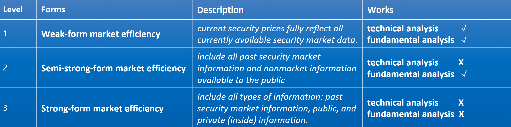

也顺便一提基于长短均线计算的金叉和死叉，这也是一种技术分析，被认为在若有效市场都无效，但是这些价量策略一直有用，特别是在量化投资当中！

《黑箱》中的阿尔法策略就提到在趋势分析中，我们基于均值回归或者自回归的预测可以有不同的策略。

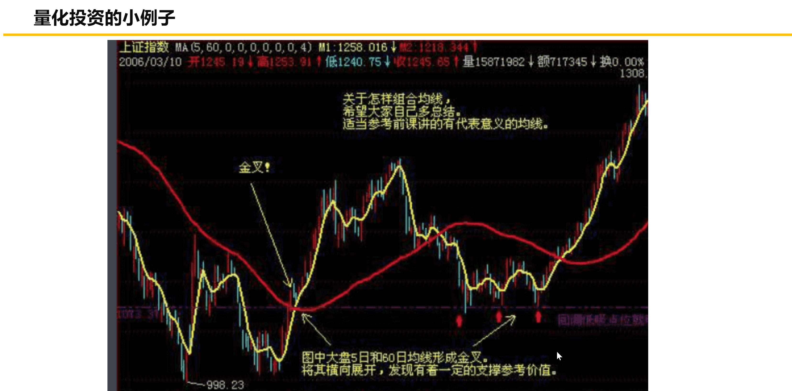


###### 五因子模型

法玛在1993年提出了三因子模型，分别是市场因子、规模因子和价值因子，他通过实证创造性的给出了驱动资产价格的相关因素，将其称为因子，自此关于因子的分析就拉开了序幕。
$$
R = RF + \beta_i^{MKT} \times (R_{mkt} - R_F) + \beta_i^{size} \times (R_{small} - R_{big}) + \beta_i^{value} \times (R_{HBM} - R_{LBM})
$$
通过上面的公式我们可以看到，等式右边第三项关于size的计算就是一种规模因子的构建方式。我们可以这样理解这个规模因子，我们先拿股票市值进行排序，然后拿出排名靠前的10%的公司，就是大盘股，然后再取排名靠后的10%的公司，就是小盘股，我们可以做多这个小盘股，然后做空这个大盘股，这样可以将股票的其他因素给对冲抵消掉，如政策影响等，从而获取了比较**纯粹的规模因子**。价值因子与其类似，只是关注的是股票的账面价值除以市场价值的比率，其实也就是B/P，如果这个比率越低，证明股票的市场价值越高于股票的账面价值，价值性越低。

15年法玛又增加了盈利因子和投资因子，形成了现在的五因子模型。但是市场上已经有太多其他经典的因子了，下面我贴出了几个。通过学习因子这种pair trading的方式，我们可以根据金融理论构造出更多的因子，然后组建一个因子库去查看因子的收益情况，这种策略就是**多因子投资策略**。

因子和股票一样，既有收益也有风险，但是由于大多数因子构建出来都更加纯粹，所以基于因子投资会比直接投股票更好管控风险。但是最终落实到投资时，因子的投资又没有股票那么直观，甚至由于做空和市场准入的限制，有些因子都无法投资。

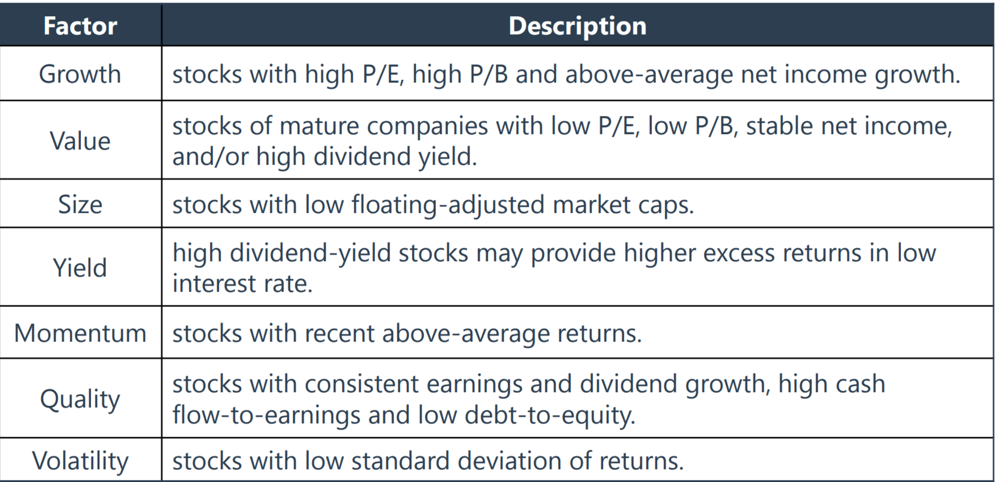

**扩展阅读：**

[1] [关于Fama-French五因子模型的学习探讨](https://zhuanlan.zhihu.com/p/124188020)

#### 行为金融学

上面介绍的都是传统金融学的概念，随着对金融研究的不断深入，以及心理学、认知科学的跨学科结合，加上市场上出现了一些用传统金融学无法解释的异常，人们开始关注基于行为活动的金融学。

##### 传统金融学的挑战

还记得我们在传统金融学提到的理性人假说吗？它是传统金融学的基石，我这里再列下3个Perfect：

- ①perfect rationality（完全理性），比如如果要买基金，我得把市场上的基金都研究一遍，然后找到最好的那只
- ②perfect self-interested（充分自利），追求效用最大化，下面会展开介绍
- ③perfect information（获取所有信息），我们可以获取市场上的所有信息来进行决策

但是在行为金融学的研究里，我们认为这个基石不再牢靠，主要有：

- ①针对rationality：人是Bounded rationality（有限理性的），比如投资时你不是把市场所有的股票看完再投资，而是Acceptable就可以了；
- ②针对self-interested：人是会Prioritizing short-term (spending) goals（追求即时满足）的，所以并不表现的充分自利，比如年轻人超前消费；
- ③针对information：人做决定是absense完全信息的

此外针对效用曲线发现，人有时候也会risk-seeking，比如面对收益可能是风险厌恶面对损失的时候是风险追求，其实人是损失厌恶（loss-averse）。这个挺有意思，可以扩展以下。举个例子，之前的风险态度中，如果有两个选择，A选择是稳赚10W，另一个B选择是赚20W和0W各50%，那么会有以下三种情况：

- 选择了A的，是risk-averse，他更追求certainly gain，传统金融学一般假设是这种人，对于Expected Value<0的项目一般也不会参加
- 选择了B的，是risk-seeking
- 对A和B都indifferent的，是risk-neutral

但是如果换一个场景：投一枚均匀的硬币，正面为赢，反面为输。如果赢了可以获得5000元，输了失去5000元。你愿意玩这个游戏吗？从整体上来说，这个游戏输赢的可能性相同，是绝对公平的。但大量类似实验的结果证明，多数人不愿意玩这个游戏。虽然输赢的概率是完全相等的，但是人们对“失”比对“得”敏感。想到可能会输掉5000元，马上觉得很不舒服，这种不舒服的程度超过了想到可能赢来5000元的快乐。

**所以总结来看：当涉及的是收益时，人们表现为风险厌恶。当涉及的是损失时，人们则表现为风险寻求。**

##### 行为金融学的偏差案例

我这里简单介绍一下，但不会展开讲行为金融学的偏差，但是我建议大家可以后面了解一下，以为行为金融学的很多偏差都是心理学范畴的，认识这些偏差一个是能够更好的了解自己去规避这些问题，还有可能去应用到商业活动中。

总的来说行为金融学的偏差主要分为两类，一个是Cognitive errors（认知错误）来自于basic statistical（统计），information-processiong（信息处理）, or memory errors，它是可以被correct（修正）的。另一个是Emotional biases（情感偏差）则来自于impulse（冲动）和intuition（直觉），它只能被adapt（适应）。我下面列出了主要的细分案例。

书中（P10 G33）讲到的处置效应就属于情感偏差下的损失厌恶（loss aversion bias），这也是上面刚提到的损失厌恶。这种偏差非常常见，比如我们如果投资了10个股票，有5只赚钱5只亏钱了，当现在需要钱的时候，大多数人会更倾向于把赚钱的给兑现，而亏损的股票暂时不去处置，好像这些亏损的股票后面能涨回来并且比原本收益的涨的还更多一样。这种变现收益但不变现亏损的行为就叫做处置效应。量化投资的程序化交易的确可以规避这个问题。


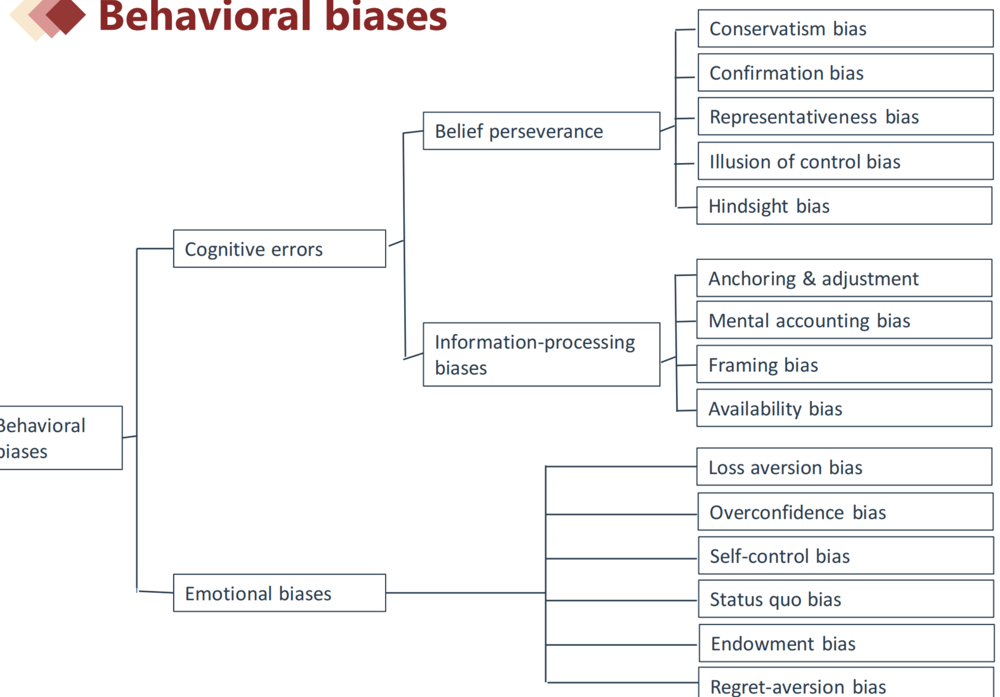

**扩展阅读：**

[1] [行为金融学偏差](https://nbviewer.org/github/fcncassandra/code-for-CFA/blob/main/BF.ipynb#R8-The-Behavioral-Biases-of-Individuals)

### 估值理论

介绍完了金融学的发展脉络，应该帮助大家补充了不少学科知识，接下来我们就到行业的一些应用当中。首先就是估值理论。

估值理论可以分为绝对估值和相对估值。

#### 绝对估值——DCF

绝对估值的方式就是我们自己通过某种模型算出一个股票的价值，然后和现在股票的价值对比，来判断股票高估低估，从而决定是否买进。

抛开股票不谈，我们看一个衡量项目收益的通用指标NPV。**NPV**（net present value，净现值）指未来资金流入现值与未来资金流出现值的差额。其中CF指的是每一阶段的现金流（cash flow），r就是现金流的折现率。

代入到一个商业住宅的项目，第一年我要雇人去建这个写字楼，之后每年收租，那么第一期的现金流CF0是一个巨额负数，之后每期CF1、CF2都是正数，而折现率是我做其他事情的**机会成本**，比如如果我不做这个项目，我的钱也是可以产生价值的，我可以全部买收益率为2%无风险的国债，那么每年我都能收到国债的本息，这种过程也可以称为**货币的时间价值的体现**。由于每期我都可以投资国债，所以我每期都要用现金流除以对应期数的国债收益率。最终我将每期的现金流加和就形成了NPV，如果NPV大于0，那么这个项目是可以投资的，最起码不会比直接买国债赚的少。

这种计算NPV的方法我们一般称为**折现现金流模型（Discounted Cash Flow，DCF）**

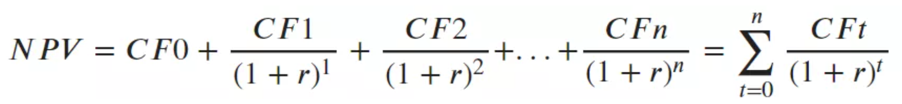

接着我们可以套上股票的案例了。股票的投资收益主要来自于2个方面，一个是大多人股民追求的低买高卖的价差收益，也称为资本利得（Capital Gain/Loss），另一个就是股票固定分红的收益，称为股利收益（Dividend）。如果我们购买一个股票，并且假设该股票每年分红一次固定的收益，我将一辈子持有这个股票，则可以将这个过程看成初始时我花钱投资了一个项目，然后每年拿到项目的固定分红，我可以按照NPV的方法计算投资股票的最终价值，如果这个价值大于0，则这个股票我就可以投资。由于金融投资就是在寻求套利机会，所以我们会认为NPV=0的时候没有套利机会，所以公式可以进行下面的转换。这种基于股利的投资模型又称为**股利贴现模型（Dividend Discount Model， DDM）**。

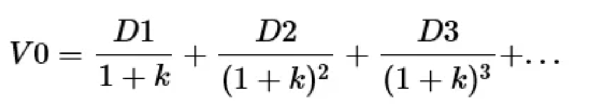

进一步的，不少公司的分红不是一个固定的，我们可以假设有一个增长率g，如果折现率大于增长率，那么这样的等比数列求和公式可以进一步计算，最终形成的模型又称为戈登股利增长模型（Gordon Model）

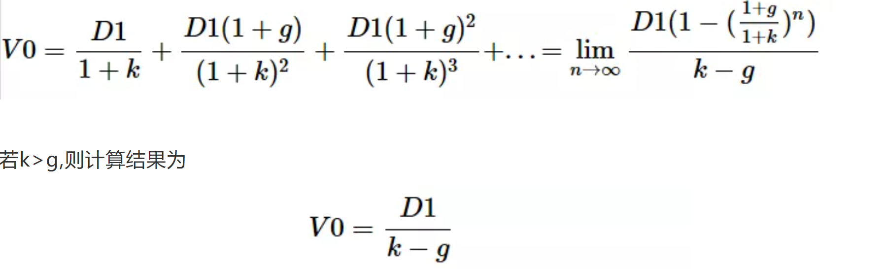

计算股票或者其他资产价格的绝对估值法可能还有很多其他变种，比如基于公司财务自由现金流的股票价格计算、基于债券利息的现值计算等等。但是万变不离其宗，无非是更改了上面的现金流或是下面的折现率。

**扩展阅读：**

[1] [Time Value Caculation](http://mp.weixin.qq.com/s?__biz=MjM5MTk5MTgxNg==&mid=2247483708&idx=1&sn=f29b3be5a0614508326fd47127eb5504&chksm=a6ac505b91dbd94dbe83523394090983e203721491062f91bf7598c02d08929ad4840bb060b8&scene=21#wechat_redirect)

[2] [Portfolio Risk and Return](http://mp.weixin.qq.com/s?__biz=MjM5MTk5MTgxNg==&mid=2247483720&idx=1&sn=fb37bcdbb656f4a8316e1bc7a92c911d&chksm=a6ac502f91dbd9391c9816ce996b2ab229f780a83e7dac5f39384e26d1da79d8da89ff1e46be&scene=21#wechat_redirect)

#### 相对估值

##### 价值指标

相对估值法和绝对估值法不同，并不需要从0到1计算出购买股票的NPV然后和股票对比，一个是可能假设太多、基于财务报表的收益计算要结合业务会很麻烦、数据也比较难获取，还有更重要的是，公司的价值是一回事，市场的认同是另一回事，特别是两个不同的行业之间，比如如果是同样的利润，科技公司的市值肯定会比传统行业高很多。下面主要介绍三个重要的相对估值指标PB PS PE以及适用场景。

- **PB(市净率)＝市值÷净资产**。通常情况下，PB适用于那些拥有大量固定资产且周期性较强的行业，对于软件、电商等固定资产较少、商誉较重的行业就不太适用了。
- **PS(市销率)＝市值÷销售额**。PS估值适用于利润为零或负的电商、软件等未来价值较高的行业。例如京东2015年销售额高达1813亿元，但净利润亏损94亿元。这是一种战略性亏损，是投资性支出带来的亏损，这是对未来的投资，长远看是很值的。
- **PE(市盈率)＝市值÷净利润**。市盈率法是对企业估值最普通、最普遍的方法。一般来说，市盈率估值不适用于利润为零及负的公司。不考虑行业特殊性：0～13倍，价值被低估；14～20倍，正常水平；21～27倍，价值被高估；28倍以上，出现投机性泡沫。PE也可以理解成在不考虑货币的时间价值情况下，如果每年都获得当前的净利润，多少年后才能再造一个公司自己。PE越高也不能单纯理解成市值虚高，对于快速成长的高科技企业来说我们还要考虑其增长率G，所以产生了一个**PEG（PE/G）的新指标**，如果公司A的PE=50，B的PE=100，但公司A的G为10%的增长率，而B的G为100%，则A的PEG为500，而B的PEG为100，所以A的市值更加虚高，不值得投资。

如果使用PE来估值，那么我们就可以把行业其他股票的PE算个平均值，然后算出公司当前的净利润（这个财报就有），然后就能计算出公司的市值或者股票价值是多少了。一般大部分的券商研究报告也是这么做的：

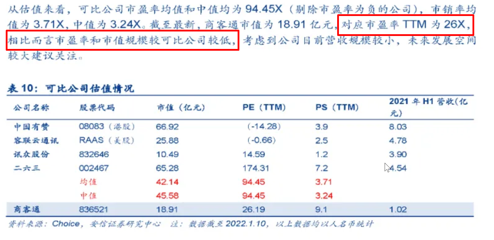

**扩展阅读：**

[1] [股票如何估值——PE、 PB、ROE](https://zhuanlan.zhihu.com/p/278236198)

[2] [商客通研究报告](https://mp.weixin.qq.com/s/IPcIJ_y5FpQ5_ObkCjgPKg)

##### 风险补偿

风险补偿不算传统的相对估值方式，但是我这里专门列出来是帮助大家强化一下金融思维。

我们之前说了，高收益一般伴随着高风险，那么反过来，如果我寻求了高风险，你是否应该给我一定的风险补偿呢？这种比较方式在股票中比较少，但是也可能偶尔存在，但是在固定收益的债券中就太多了。比如同样是国债和一个高评级的公司债，国债的安全度肯定更高，那我为什么要买公司债呢？假如公司不还怎么办？所以为了进行这方面的信用风险补偿，就需要增加公司债的收益率，否则将少有人问津。


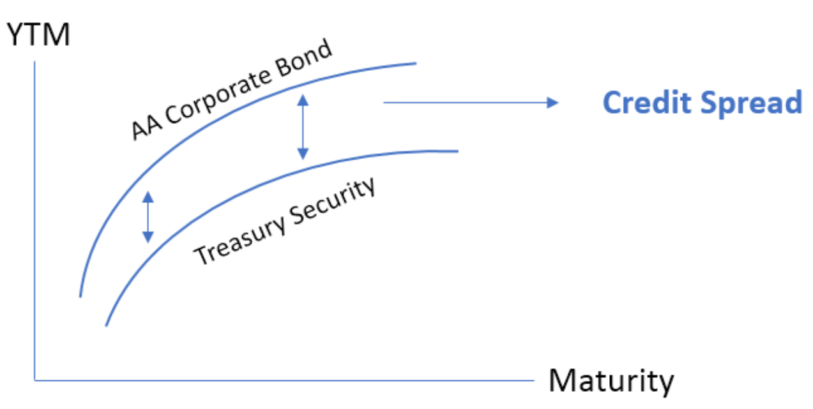

**扩展阅读：**

[1] [【债券知识】收益率差 Yield Spread](https://www.sohu.com/a/300357590_820538)

### 风险理论

#### 系统性风险和非系统性风险

开始股票越多，波动率迅速下降，但是当整个投资组合的股票数量超过40只的时候，整体的投资组合波动率开始趋于稳定，并且只保持在20%的水平，因此可以得出两个结论：

- 1 当投资组合超过40只股票的时候，投资组合的风险已经很接近系统性风险了
- 2 波动率20%可以看做是系统性风险

**非系统性风险可以分散化消除，但是系统性风险只能对冲！**

```python
stocks_data = pd.read_excel('./上证180指数成分股日收盘价（2016-2018年（剔除该期间上市的股票））.xlsx',\
                          sheet_name='Sheet1', header=0, index_col=0)
# 计算每只股票的日收益率数据
return_stocks = np.log(stocks_data/stocks_data.shift(1)) #建立股票日收益率时间序列
return_stocks = return_stocks.dropna()
n = len(return_stocks.columns)
vol_port = np.zeros(n)
for i in range(1, n+1):
    weight = np.ones(i)/i
    return_cov = 252*return_stocks.iloc[:,:i].cov() #依次计算投资组合中股票收益率的年化协方差
    vol_port[i-1] = np.sqrt(np.dot(weight, np.dot(return_cov, weight.T))) #依次计算投资组合中股票收益率的年化波动率
N_list = np.arange(n)+1 #1到155
plt.figure(figsize=(8,6))
plt.plot(N_list, vol_port, 'r-', lw=2.0)
plt.xlabel(u'投资组合的股票数量', fontsize=13)
plt.ylabel(u'投资组合的波动率', fontsize=13, rotation=0)
plt.xticks(fontsize=13)
plt.yticks(fontsize=13)
plt.title(u'投资组合中股票数量与投资组合的波动率之间的关系', fontsize=13)
plt.grid('True')
plt.show()
```

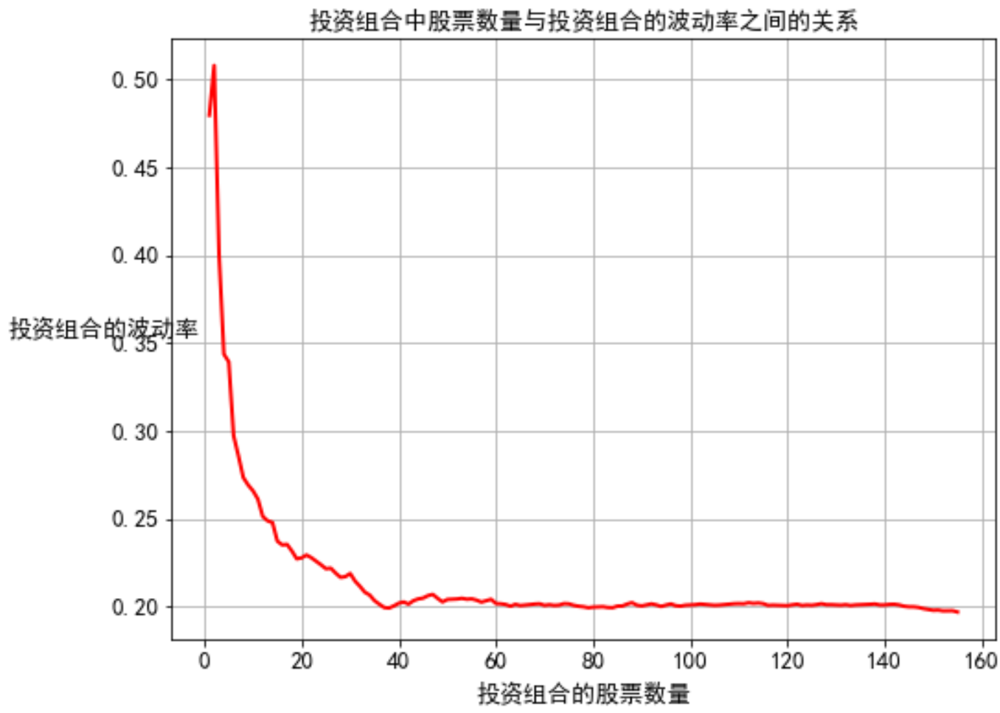


#### VaR——在险价值

在度量风险时其实可以有两种方法。一个是用我们上面介绍的标准差来衡量波动的风险，但标准差只是一段时间收益率的平均波动体现，而在资产管理中，我们更加关注的是造成损失的波动，特别是较为极端的损失，此时用标准差来表示就比较困难，

对此，我们可以基于大量的历史案件用另一种置信水平的方式进行度量，也是**金融投资中更常用的VaR。**VaR(Value at Risk)方法是一种直观度量金融风险的风险控制模型，表示未来在一定显著性水平下金融资产的最大可能损失。其表达式为:**P（Loss <= VaR) = α**，其中 Loss为金融资产价值损失 。如果loss为1000万，而α为5%，这个公式我们可以这样表述：**有95%的把握该资产的损失最大不超过1000万。**

对于资产A，我们如何计算其VaR值呢？主要由两种方法：

- 分布模拟法：我们可以假设这个资产服从某种分布，比如(0%, 2%)的正态分布，然后我们去做很多次的模拟计算出其收益的分布，接着从其损失的尾部砍一刀，让其左侧围城的面积正好等于显著性水平α，此时这刀在的位置就是该置信水平对应的VaR值。
- 历史模拟法：另一种方法更加简单也实用，我们可以直接取到资产A的历史收益率数据，然后基于这个数据做出一个真实的分布，接着用同样的方法砍一刀。需要注意的是，这里的计算可能比模拟更加直观，比如我们现在有100条历史收益率数据，然后我们想取到5%显著性水平的α也即95%置信水平的VaR，此时就可以把这100条数据从大到小进行排序，然后取到第5条数据就是**95%的VaR**，如果是99%的VaR则是取到第1条，如果碰到更严格的99.5%和99.9%时，可能需要更多的数据才有意义。如图即当显著性水平为 5%时的 VaR 值。


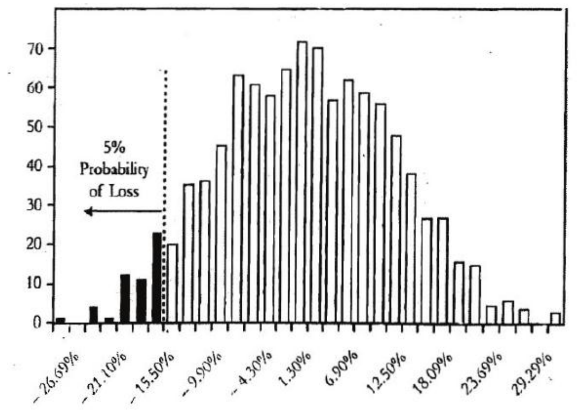

##### Expected Shortfall

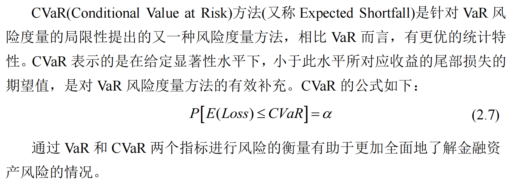


##### LVAR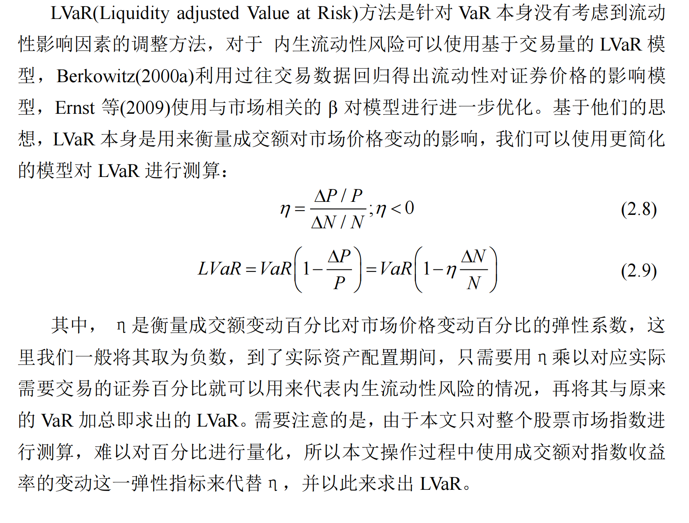

##### Copula函数

如果组合有多个资产，并且这些资产还有一定的相关性，那么如何计算组合的风险呢？

在使用标准差度量风险时，我们利用协方差矩阵计算出整体的风险，而在使用VaR时已经牵扯到了概率的分布，所以需要使用Copula的方法构建联合分布函数。

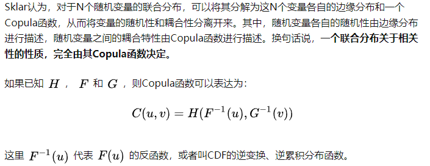

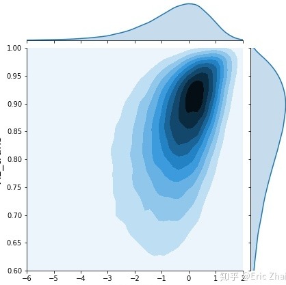

#### 风险预算和平价

到了资产组合管理层面如何权衡组合的VaR值呢？这里我们要引入边际 VaR和组合VaR

边际VaR（Marginal VaR）由投资组合中单个资产的边际变化引起的组合VaR变化的大小，也就是组合VaR对于单个资产头寸市值变化的敏感性。

成分VaR（Component VaR）在不考虑相关性和边际效应递减的情况下，可以看成这个资产的边际 VaR乘上对应组合的权重。

在应用上

- ①如果投1\$应当投MCTR最低的项目；

- ②如果A的MCTR大于B，则对A减仓对B加仓；

- ③既考虑收益有考虑风险时，最佳的分配方式是每个资产每边际VaR的超额收益都相同
  $$
  \frac{r_i - r_f}{MCTR_i}
  $$
  

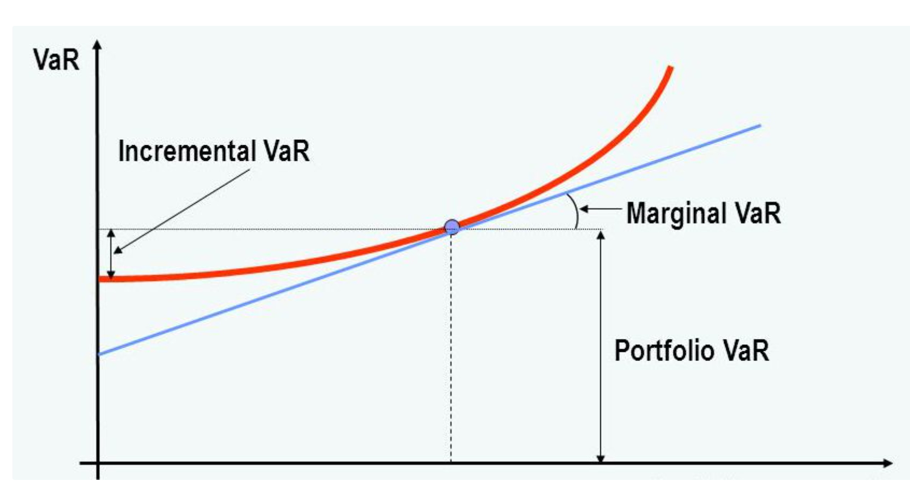

#### 巴塞尔协议

VaR值在金融市场风险管理中起到了关键作用。银行作为经济市场的重要主体，更加需要对风险进行严格的管控，对此专门有巴塞尔协议去对其进行约束。

巴塞尔协议III定义了信用风险、市场风险和操作风险，外加一个流动性风险的管理。前三大风险分别根据不同的场景计算99%置信水平下的VaR值作为违约的风险敞口（Exposure At Default， EAD），然后再乘上对应的违约率（Probability of Default，PD）和损失收回比率（Loss Given Default，LGD），这样就可以算出期望的一个**风险敞口**是PD x LGD x EAD。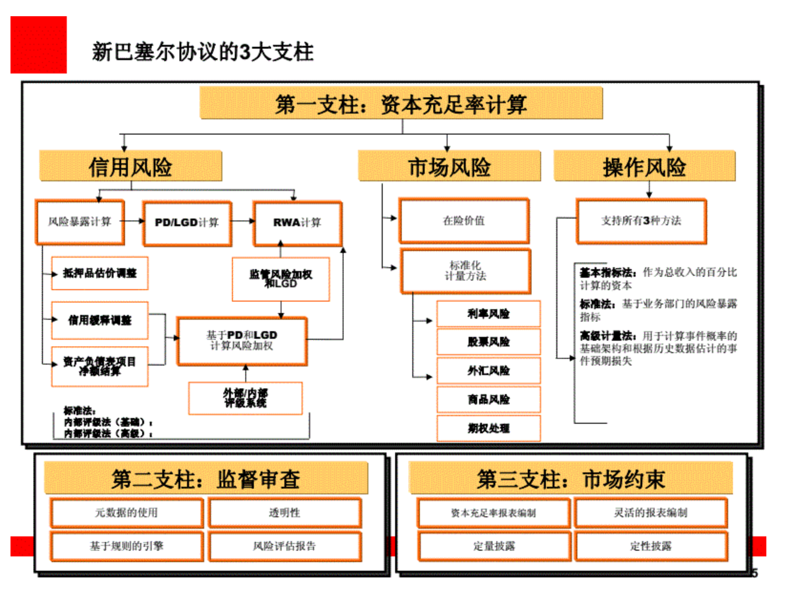

**扩展阅读：**

[1] [投资组合VaR分解方法简介](https://www.weivol.cn/2018/02/marginal-var-intro/)

[2] [在险值Var（Value at Risk）的计算案例](https://zhuanlan.zhihu.com/p/422713418)

[3] [Copula系列（一）-什么是Copula函数](https://zhuanlan.zhihu.com/p/138800469)

[4] [三个版本的《巴塞尔协议》有什么区别？](https://www.zhihu.com/question/67620585)

#### 

## 证券投资

### 交易过程

#### 交易动机

首先是交易动机，传统的投资主要包括四类，量化投资可能目的会更简单：

- ①Profit seeking，赚钱，Trade urgency（交易紧急程度）取决于alpha decay的速度；
- ②Risk management/hedging needs，风控，如duration match和beta management；
- ③Cash flow needs，需要现金流，client-driven客户发起的，看交易紧急程度，如果很急就用collateral和margin call，如果不是很急就用长期的资产配置改变，为了减少中间过程中的cash drag（闲置资金的成本）可以投资ETF等；
- ④其他：Corporate actions/index reconstitutions/margin calls

#### 交易执行

##### 交易场所

按照传统的投资分成两类：

[1] higher-touch approaches，相当于exchange交易所，监管更加严格，一般是大单
其中urgency很高就找dealer，因为有bid-ask price可以立刻成交，流动性差也找dealer去request for quota（RFQ）让dealer报价
urgency低就和broker成交

[2] straightforward trades in liquid securities，相当于broker券商提供的，监管松一点
Alternative trading systems (ATS，美国) multilateral trading facilities (MTF，英国)
**Direct market access (DMA)**交易所直连的，跳过broker追求速度快
**Dark pools**，券商交易所给内部客户撮合的，撮合不了再去交易所报价，所以urgency程度很低

##### 算法交易

使用交易算法的目的是为了最小化交易成本和寻求利润。**这其中最需要权衡的是紧急程度和交易成本**，如果发现了一个很好的套利机会，非常紧急，一个单子下来可能会影响股价，但是我为了抓住机会可以容忍高成本的成交。如果我不是很紧急，那么就可以慢慢成交，这样对市场的影响会小点，交易成本也会少点。

比如我现在有1万手想要购买，现在股价是10元，我忽视算法的作用直接一股脑下单，可能就导致股价涨到11元全部成交，这样成本就上来了，更有可能今天直接涨停到12元，大部分都无法成交。而如果使用算法，我按照某种策略进行交易，可能不仅能全部成交，最后一笔交易完股价还没有波动。

这边主要介绍三类算法，也是《黑箱》中提及的：

**（1）事先已经确定的**，包括VWAP、TWAP、POV

- [1] VWAP algorithms，尽可能的让下单平均价格接近市场的的VWAP价格
  执行：将一天4小时交易按5分钟分拆（time slicing schedule），每5分钟算出过去5天/10天/20天的平均总交易量占全天总成交量的比例，接着按这个比例购买
  优点：利用了流动性优势
  缺点：流动性差的股票可能全天无法成交 其他：因为按交易量来，所以开盘和收盘时交易量一般最大，整体是U-curve

- [2] TWAP algorithms，和VWAP的最大区别是等权重
  执行：将一天4小时交易按5分钟分拆（time slicing schedule），然后等权购买
  **优点：一定能够成交**
  缺点：没有利用流动性优势

- [3] POV (percentage of volume) algorithms，又叫participation algorithms（参与度算法）
  执行：和VWAP最大的区别是比例恒定，比如定10%乘上过去5天这个时间的平均成交量，相当于固定参与这么多
  优点：利用了流动性优势
  缺点：流动性差的股票可能全天无法成交；可能引发更多的交易成本

**（2）Liquidity-seeking（流动性算法）**

LS适合于大单要求**执行很快且不要有大的市场影响的**，比如virtue这个基金就是这么做的
海外交易所有Liquidity rebate，即如果提供流动性的话会给流动性回扣，可能很少只有万分之一

 **（3）Dark strategies/liquidity aggregators**

在券商提供的dark pool交易，内部客户可以直接完成交易
适用于单子大大的、流动性差的、urgency不是很高的
优点：不如lit（交易所）市场透明，可以防止information leakage

##### 交易市场比较

只是列一下，美国和国内还是不太一样。

[1] Equities，股票市场，可以在交易所和dark pool交易
Large, urgent trades找dealer直接交易；Large, non-urgent trades找broker，可以用算法交易；small trades，不着急的小单可以用电子化交易

[2] Fixed Income，债券市场，电子化交易少，其他和股票市场一样
Large, urgent trades找dealer直接交易；Large, non-urgent trades找broker，可以用算法交易

[3] Exchange-traded derivatives (options and futures)，场内衍生品，没有dealer和broker
电子化交易pervasive很广泛，算法交易也在大量使用中
Large, urgent trades，大单只能去sweep the book扫单；Large, non-urgent trades可以用算法慢慢下；small trades，不着急的小单可以用DMI（前面的交易所直连）

[4] Off-exchange (OTC) derivatives，场外衍生品都是找broker

[5] Spot Foreign Exchange (Currency) Large, urgent trades找dealer直接交易；Large, non-urgent trades找broker，可以用算法交易；small trades，不着急的小单可以用DMI（前面的交易所直连）

##### 交易评估

交易员的KPI是如何计算的呢？就是我们会事先设置一个参考的价格标准，然后看最后你成交的价格是否与其接近、单子是否尽可能的成交了。这边我们来梳理下传统的交易流程中价格的变化和成本的产生：基金经理先做决定，产生Decision Price，然后传到交易员时可能股价已经朝不利的方向波动了，从而产生了延迟成本Delay cost，接着交易员以Arrival Price下单了，经过一系列的操作不可避免的会因股价波动产生trading cost，此外还有因为交易员未能成交而错失的机会成本Opportunity cost，这些**累加的成本又叫做 Implementation Shortfall（IS）**。

下面举例：decision price是10元1000股，但是arrival price是10.3元1000股，最后成交是10.5元700股，现在涨到了12元

[1] 收益法计算
Paper return是纸面收益，是最理想的成交价格的收益，比如10元买1000股，现在12元，一共赚了2000元
Actual return是实际收益，因为Arrival price已经是10.5元并且只成交了700股，所以这里是赚了1050元
不考虑fees的话最终IS是950元

[2] 成本法计算
Delay cost，因为下单延迟造成的成本：（10.3 - 10） x 700 = 210
Trading cost，因为交易带来的成本：（10.5 - 10.3） x 700 = 140
Opportunity cost，因为没有交易到带来的机会成本：（12-10）x 300 = 600
不考虑fees的话最终IS是950元

**可以看到这个案例中IS还是很高的，所以量化交易一定要关注好交易成本模型！**

##### 业绩归因

这里介绍一个最经典的归因方法：**Brinson Model**

这个模型将传统基金经理的业绩归为三类：

- allocation effect：选行业的能力
- selection effect：行业内选股的能力
- interaction effect：其他交叉项

有时候也会变种去和同类策略的基准收益率比，而不是和大盘比。

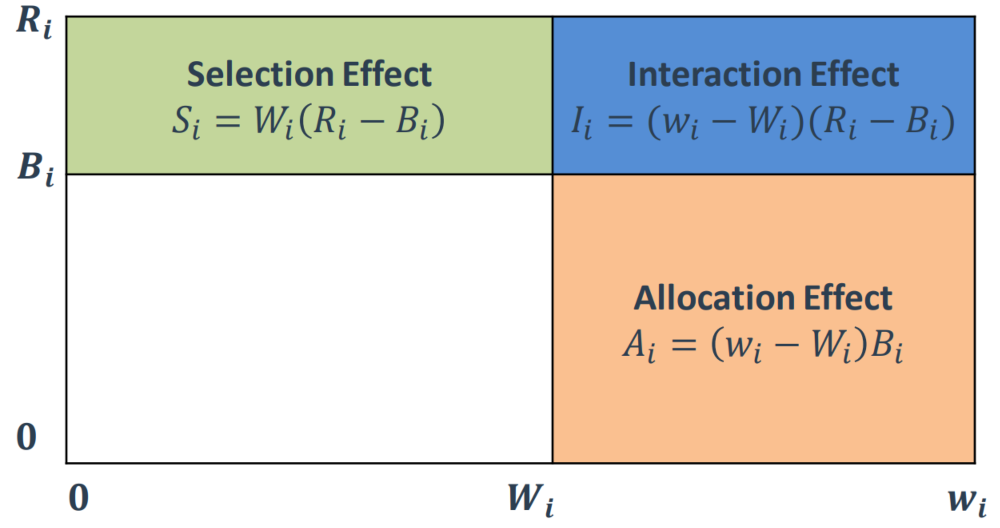

### 传统股票交易策略

如图中所示，传统的策略在量化中不一定有效：

- 被动投资是构建组合复制大盘指数，这样表现跟进大盘就可以，如果市场强有效是很好的策略
- 主动投资中和量化相关的可能是研究价值和成长以及因子

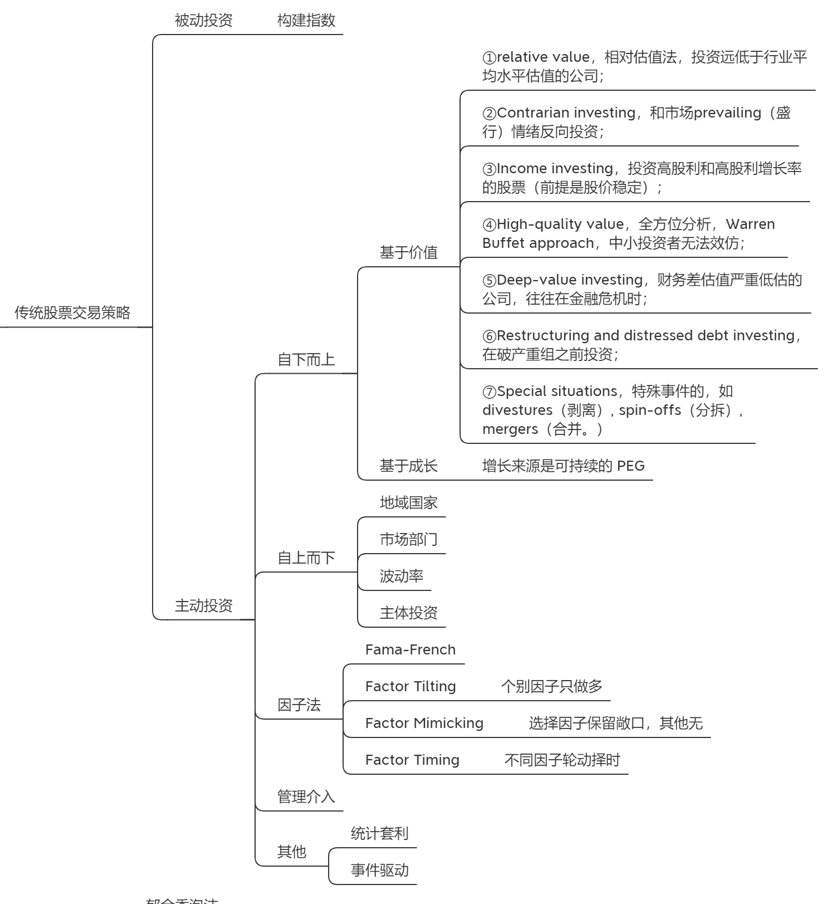

## 实务知识

### 金融重大事件

### 交易品种

### 金融工具

# 精读提问

第1-3章 卜书迪

```
1.市盈率（也许书后面会讲）
2.基本面：具体指哪些信息
3.市场均衡理论（也可忽略）
4.P34页，图和上面的“动量”都没有懂
```

第4-5章 胜金仓

```
Q1：计算VaR有哪些常用的方法？
Q2：如何使用蒙特卡洛模拟，假设分布并计算组合的VaR？
Q3：VaR指标的衍生指标？
Q4：控制风险规模时，常用的止损策略有哪些？
Q5：除了VaR，其他衡量风险的工具？
Q6：国际上有哪些成熟的暗池交易场所及模式？
```

第6-7章 冯傲

```
Q1：第六章提到的相等头寸加权，具体是指什么？
Q2：如果基于模型返回的投资组合需要重新建仓，是相信人的判断还是相信模型的输出
Q3：有没有python交易代码示例(展示投资组合)
Q4：专业机构和普通用户在执行模型上的差异？ 
Q5：如果在执行模型时，交易失败，无法达到预期的模型组合，应该如何处理？
```

第8-9章 孙萍

```
前视偏差：具体是什么含义？会带来什么问题？有没有好的解决方法
夏普比率：计算某周期内高于无风险比率的平均收益率与收益率的波动率之间的比值可得（不理解），越高，策略越好
R2与预测模型效果的关系
```

### 问题解答

金融相关内容：

EMH VS 动量

alpha 101 【看】

MACD失效原理【斜率求的不对，所求斜率滞后。MACD，拉普拉斯变换】


优化讲义：

无差异曲线就是单个财富，结构财富获得的时候再讲风险和收益，需要再贴图，并且将BF中的例子前置一下

说清楚取多个垂直于 x 轴的线，然后根据REM取到相同风险最优的那个收益率

说明清楚代码中的展示是效果图，真正有效前沿是最优化算出来的

结合债券为什么就变成那条直线需要讲清楚
