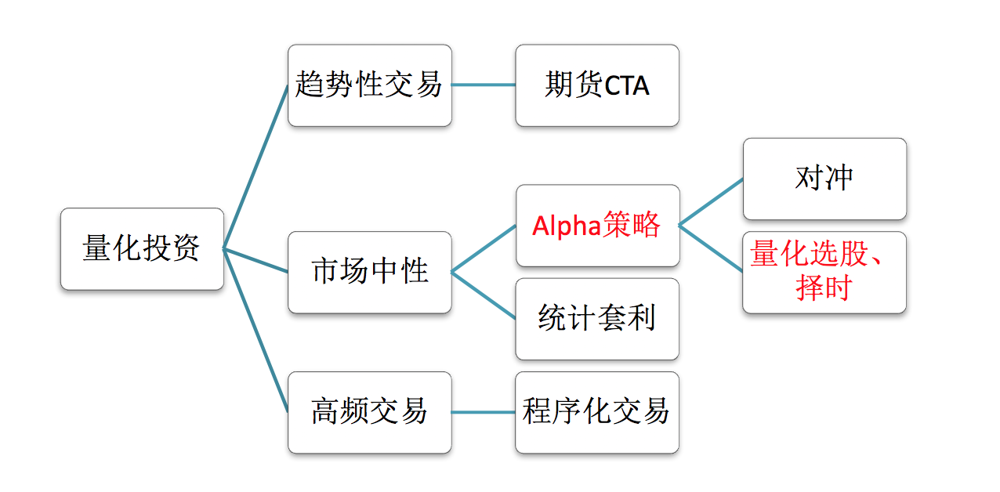
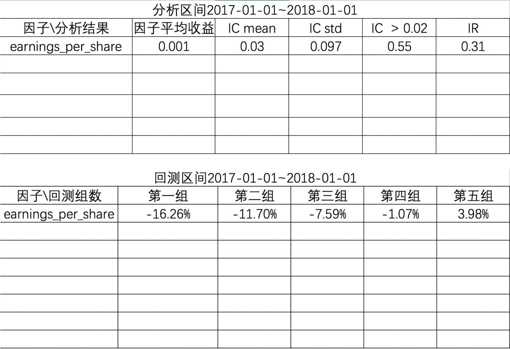
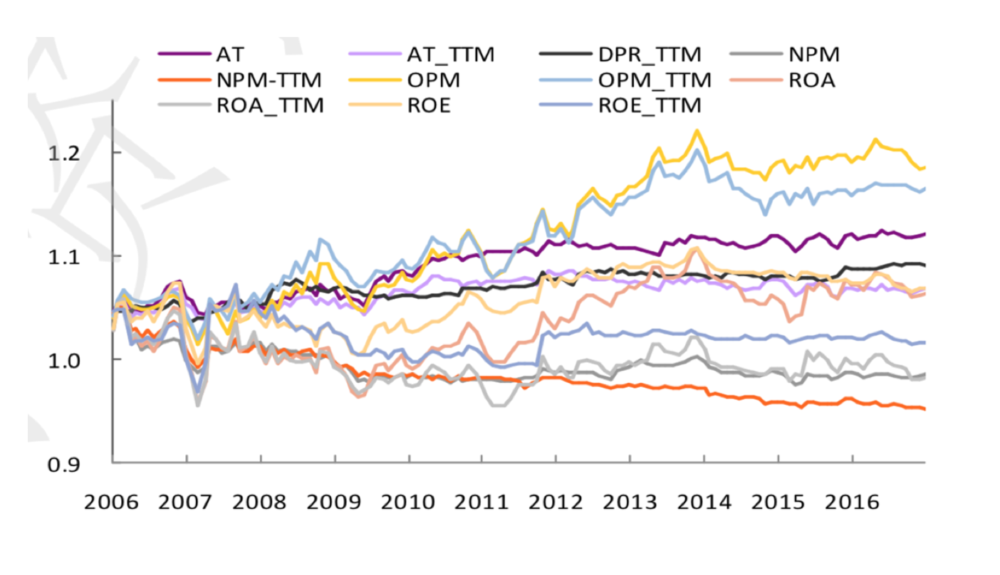
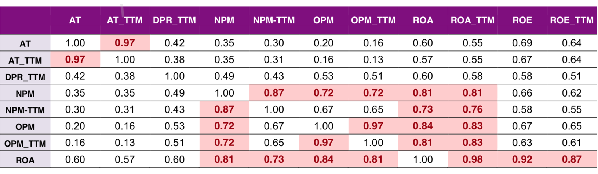

# 量化交易

## 1 量化交易的分类



- 趋势性交易
  - 适合一些主观交易的高手，用技术指标作为辅助工具在市场中如鱼得水的，但如果只用各种技术指标或指标组合作为核心算法构建模型，从未见过能长期盈利的。
  - 一般也会做一些量化分析操作，使用编程如python/matlab 。
- 市场中性
  - **在任何市场环境下风险更低，收益稳定性更高，资金容量更大。适合一些量化交易者，发现市场中的alpha因子赚取额外收益，例如股票与股指期货的对冲策略等。**
  - 会做一些量化分析操作，使用编程如python/matlab。
- 高频交易
  - 在极短的时间内频繁买进卖出，完成多次大量的交易，此类交易方式对硬件系统以及市场环境的要求极高，所以只有在成熟市场中的专业机构才会得到应用
  - 适合一些算法高手，使用C/C++编程语言，去进行算法交易，对软硬件条件要求比较高。

> 1、金融专业出生，对金融市场环境非深入了解（交易员、基金经理）
>
> 2、基本了解金融基础、投资知识，对数据挖掘、机器学习方法擅长，挖掘股票等的价值 （quanter）
>
> 3、非常擅长算法，C/C++ ，编写程序化的一些交易方法 （程序化交易员）

## 2 多因子策略流程

1 准备数据，进行数据去极值、标准化、市值中心化

2 对单因子进行有效性检验，比如IC信息系数

3 然后进行多因子的组合，进行相关性分析和合成

4 确定因子的权重，利用打分、回测

5 确定股票池以及排序选股

6 确定调仓周期

7 计算组合业绩

### 2.1 数据处理

#### 2.1.1 去极值

##### 2.1.1.1 分位数去极值法

```python
# 求出两个分位数的点的值
def quantile(factor,up,down): 
 """分位数去极值  """  
  up_scale = np.percentile(factor, up)   
  down_scale = np.percentile(factor, down)   
  factor = np.where(factor > up_scale, up_scale, factor)   
  factor = np.where(factor < down_scale, down_scale, factor)  
  return factor
```

##### 2.1.1.2 中位数绝对偏差法

MAD，中位数绝对偏差法（Median Absolute Deviation）

```python
def mad(factor):
  """3倍中位数去极值"""
  # 求出因子值的中位数
  med = np.median(factor)
  # 求出因子值与中位数的差值，进行绝对值
  mad = np.median(abs(factor - med))
  # 定义几倍的中位数上下限
  high = med + (3 * 1.4826 * mad)
  low = med - (3 * 1.4826 * mad)
  # 替换上下限以外的值
  factor = np.where(factor > high, high, factor)
  factor = np.where(factor < low, low, factor)
  return factor
```

##### 2.1.1.3 正态分布去极值法

3sigma法

```python
# 3sigma原则
def three_sigma(factor):
  # 求出因子数据的平均值和标准差
  mean = factor.mean()
  std = factor.std()
  # 左右的数据加减3个标准差
  high = mean + (0.01 * std)
  low = mean - (0.01 * std)
  # 替换极值数据
  factor = np.where(factor > high, high, factor)
  factor = np.where(factor < low, low, factor)
  return factor
```

#### 2.1.2 标准化

```python
from sklearn.preprocessing import StandardScaler
std = StandardScaler()
std.fit_transform(factor['pe_ratio2'])
```

或

```python
def stand(factor):
  """自实现标准化
  """
  mean = factor.mean()
  std = factor.std()
  return (factor - mean)/std
```

#### 2.1.3 市值中性化

- 获取两个因子数据
- 对目标值因子-市净率进行去极值、标准化处理
- 建立市值与市净率回归方程
- 通过回归系数，预测新的因子结果y_predict
- 求出市净率与y_predict的偏差即为新的因子值

```python
# 1、获取这两个因子数据
q = query(fundamentals.eod_derivative_indicator.pb_ratio,
         fundamentals.eod_derivative_indicator.market_cap)

# 获取的是某一天的横截面数据
factor = get_fundamentals(q, entry_date="2018-01-03")[:, 0, :]

# 先对pb_ratio进行去极值标准化处理
factor['pb_ratio'] = mad(factor['pb_ratio'])
factor['pb_ratio'] = stand(factor['pb_ratio'])

# 确定回归的数据
# x：市值
# y : 因子数据
x = factor['market_cap'].reshape(-1, 1)
y = factor['pb_ratio']

# 建立回归方程并预测
lr = LinearRegression()
lr.fit(x, y)
y_predict = lr.predict(x)

# 去除线性的关系，留下误差作为该因子的值
factor['pb_ratio'] = y - y_predict	
```

### 2.2 因子有效性检验

#### 2.2.1 IC分析

斯皮尔曼相关系数(Rank IC)分析：某时点某因子在全部股票因子暴露值排名与其下期回报排名的截面相关系数。

IC分析的目的是确定因子方向，得出因子分析的两张表



```python
# 1、获取因子数据
q = query(fundamentals.eod_derivative_indicator.pe_ratio)
fund = get_fundamentals(q, entry_date="2017-01-03")[:, 0, :]
# 2、获取当天和下一期的收盘价格
price_n = get_price(list(fund.index), start_date="2017-01-03", end_date="2017-01-03", fields="close").T
price_next = get_price(list(fund.index), start_date="2017-01-04", end_date="2017-01-04", fields="close").T
# 3、计算收益率, 填充缺失值
price_now.iloc[:, 0].fillna(price_now.iloc[:, 0].mean(), inplace=True)
price_next.iloc[:, 0].fillna(price_next.iloc[:, 0].mean(), inplace=True)
# 4、下期价格- 当前价格/ 当前价格, 这里计算的是下期的收益率 2017-01-04
return_price = price_next.iloc[:, 0]/price_now.iloc[:, 0] - 1
# 5、计算相关系数,是一个值，在[-1, 1]  IC 
st.spearmanr(fund.iloc[:, 0], return_price)
```

也可以用Alphalens，但是quantopian公司[倒闭了](https://www.sohu.com/a/428521176_505915)

```
    在国外大名鼎鼎的quantopian 体系下，有三大著名的用于量化分析的python包，分别是zipline包，用于支持各种回测，支持分钟和日线级别回测，是最常用的一种，优矿和聚矿据说也是基于此的；Alphales 包也是用于回测，但主要使用在初期的因子回测，用以更快速的计算因子的收益、因子的IC、换手情况和并画出不同分类的净值曲线图。Pyfolio个人用的不太多，主要是配合zipline主要用来分析因子风险

作者：量化小王子
链接：https://xueqiu.com/9842090891/120038584
来源：雪球
著作权归作者所有。商业转载请联系作者获得授权，非商业转载请注明出处。
风险提示：本文所提到的观点仅代表个人的意见，所涉及标的不作推荐，据此买卖，风险自负。
```

#### 2.2.2 因子收益率

**因子收益率是在固定周期内对因子暴露值和下期的收益率之间建立横截面回归方程**。得到的权重系数即为因子收益率

因子值 x 因子收益率 + 截距 = 收益率

### 2.3 多因子相关性分析

通过IC值变化图和spearman rank法计算





### 2.4 多因子合成

使用PCA方法进行多因子合成

### 2.5 多因子选股

多因子选股最常用的方法就是打分法和回归法，但是至于这两种哪个效果更好需要进行实际的模拟交易或者实盘交易之后才能确定。通常模拟交易测试结果来说，打分法效果更好。

- 打分法选股
- 回归法选股

这两种方法都是在确定因子的权重来选择固定的股票。什么是确定权重再去选股呢？

#### 2.5.1 打分法选股

- 1、回测区间：
  - 2010-01-01 ~ 2018-01-01
- 2、选股：
  - 选股因子：6个已知方向的因子
  - 选股权重：
    - 因子升序从小到大分10组，第几组为所在组得分
    - 因子降序从大到小分10组，第几组为所在组得分
  - 数据处理：处理缺失值
- 3、调仓周期：
  - 调仓：每月进行一次调仓
  - 交易规则：卖出已持有的股票
  - 买入新的股票池当中的股票

#### 2.5.2 回归法选股

- 1、回归训练区间

 2012-01-01 ~ 2014-01-01

- 2、回归股票池

 股票池（HS300指数）

- 3、回归因子数据准备、收益率计算

 因子数据：横截面数据拼接，添加日期数据、去除空值 收益率计算: 所有样本的收益率计算

- 4、目标值特征值提取进行回归估计

 数据处理：去除收益为0(价格数据不存在)、去极值、标准化处理

然后用收益率当y，所有因子当x，回归出各个特征的系数，然后基于这个系数计算每个股票的收益率

相当于预测接下来的一个月的收益率，哪个收益率高选谁

## 3 注意事项

1 选择因子时因为要进行市值中性化，所以不要留市值因子